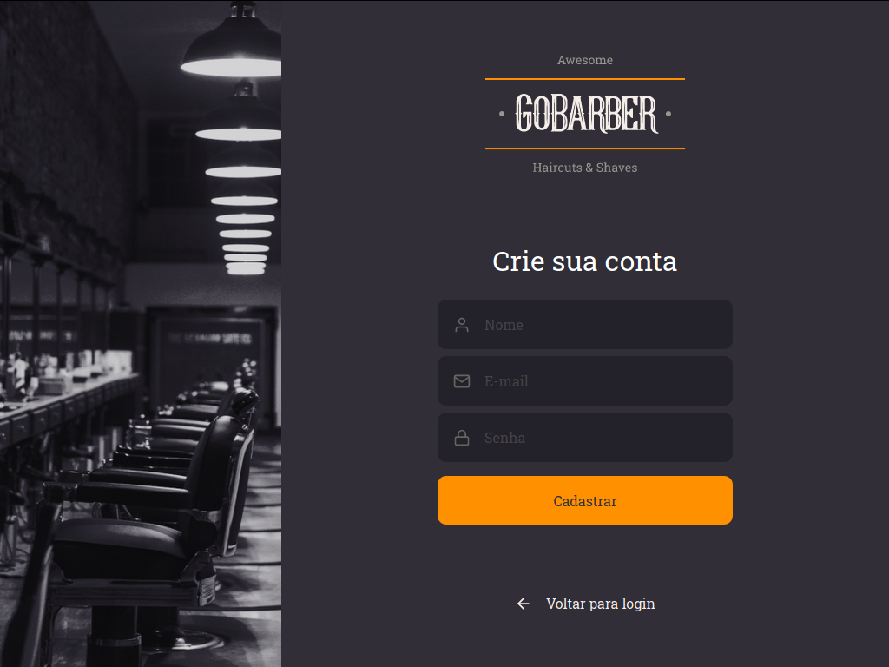

<h1 align="center">
  
</h1>

<h2> Aplicação para gerenciamento de barbearias :haircut_man: </h2>

<h3 align="center">
  GoBarber - Aplicação Frontend com React com Typescript
</h3>

<h3>
    Criado com a stack
     React Js
     React Native
     Node Js
     Sqlite
</h3>

## 📱 Projeto

  O GoBarber é uma aplicação web e mobile para gerenciamento de barbearias. Essa aplicação foi construída durante o bootcamp GoStack 11 da <a href="https://rocketseat.com.br/">Rocketseat</a>
  🚀

<h5 align="center">
  
</h5>
